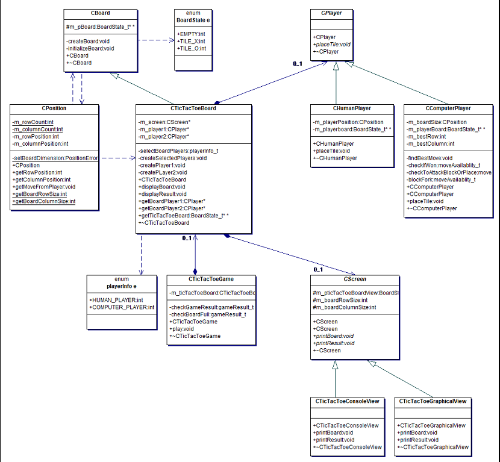

# Smart TicTacToe Board Game programmed using C++11. 
## Objective
The goal of the project is to develop a console based version of the 3 x 3 TicTacToe board game.
  * Player 1 (x) and 2(o) can either be human or computer, i.e.
    * Human against Computer
    * Human against human
    * Computer against human
    * Computer against computer are possible combinations.
  * The computer may never loose.
  * The board will be displayed as a console application.
  * Displaying the screen later on in a graphical format shall be easily supported.
  * Provide DoxyGen Style comments for all entities and create a website for your

## Working

* Model - View - Control Design pattern was used, Model is the CTicTacToeBoard , view is the CScreen Class and Control is the CPlayer.
* For the code development i have used :
   * generic CBoard , CPlayer and CScreen Class , this makes it easier to re-use the code to develop any other board game.
   * CTicTacToeGame, CTicTacToeBoard, CComputerplayer and CHumanPlayer Class is specific to the TicTacToe Game.

